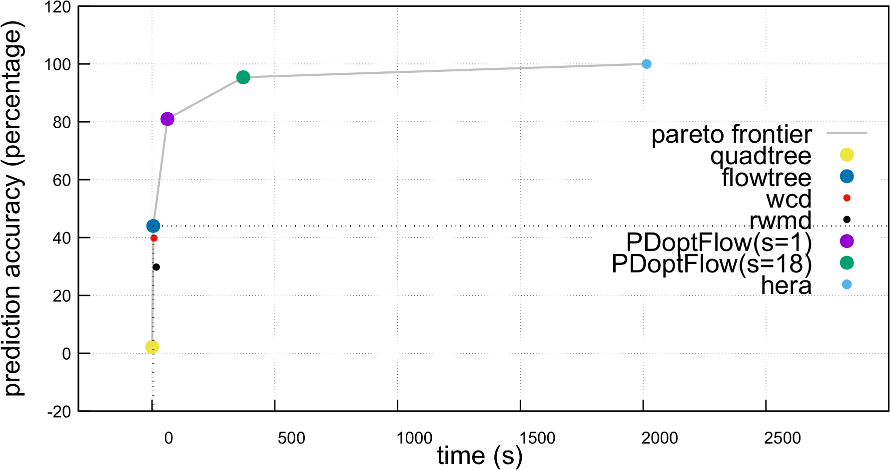

## Reproducing the Python Experiments in the Paper

### Compiling

See the pdoptflow/pdoptflow/README.md for system requirements.

You will need to compile both PDoptFlow and flowtree/quadtree to run the nearest neighbor experiment from the paper.

For manual installation:

```
git clone --recurse-submodules https://github.com/simonzhang00/pdoptflow.git
cd pdoptflow/pdoptflow
mkdir build 
cd build
cmake -DCMAKE_C_COMPILER=$(which gcc) -DCMAKE_CXX_COMPILER=$(which g++) ..
make CXX=$(which g++) CC=$(which gcc)
cp W1.cpython-38-x86_64-linux-gnu.so ../../python
cd ../python_experiments/others/w1estimators/native
mkdir build
cd build
cmake -DCMAKE_C_COMPILER=$(which gcc) -DCMAKE_CXX_COMPILER=$(which g++) ..
make CXX=$(which g++) CC=$(which gcc)
cp pd_estimators.cpython-38-x86_64-linux-gnu.so ../../../../
```
you might get a different .so file name depending on your python version, operating system and hardware. The prefix W1 and pd_estimators will always be the same.

Using installation through pip (installation through pip of w1estimators was not written):

```
git clone --recurse-submodules https://github.com/simonzhang00/pdoptflow.git
cd pdoptflow
pip3 install .
cd python_experiments/others/w1estimators/native
mkdir build
cd build
cmake -DCMAKE_C_COMPILER=$(which gcc) -DCMAKE_CXX_COMPILER=$(which g++) ..
make CXX=$(which g++) CC=$(which gcc)
cp pd_estimators.cpython-38-x86_64-linux-gnu.so ../../../../
```

### Running the Experiment

See paper for a full explanation of all the algorithms being compared.
 
checkout results.txt for results we found upon running `python3 knn_search.py 0`.

**Note:** 2x(depth of the quadtree) is the approximation bound of flowtree. This is 38 for seed 0 for the reddit dataset (others/w1estimators/python/sample_data/).

**Note:** Most (>99%) of the time in the experiment is spent computing with hera as ground truth. After running once, the ground truth candidates are cached in npz files.

#### knn_search.py
Let seed be an integer

Running `python3 knn_search.py seed` compares all prediction accuracies and timings for each algorithm: quadtree, flowtree, wcd, rwmd, PDoptFlow(s=1), PDoptFlow(s=18), hera individually.

hera is viewed as ground truth, at a guaranteed 1.01 approximation. Only PDoptFlow(s=18) can achieve >=95% accuracy at a guaranteed 2.3 approximation. Surprisingly, PDoptFlow(s=1) achieves more than 80% accuracy. All other algorithms are too rough as approximations to achieve quality nearest neighbor predictions (<=45% prediction accuracy).

#### pipeline.py
Let seed be an integer

Running `python3 pipeline.py seed` runs the pipeline 15-3-1 consisting of flowtree, PDoptFlow(s=1) with PDoptFlow(s=18) finishing. 

#### Pareto frontier

Illustration of the Pareto frontier of the time-accuracy trade off of various algorithms for computing the 1-Wasserstein distance from knn_search.py.


**Figure 1** - Pareto Frontier

### The "others" Directory

For testing, one can also run the emd2 and sinkhorn implementations from POT. These files are taken from GUDHI. However, these are not really feasible algorithms to compute PD distances since they require O(n^2) memory.

#### wasserstein_emd2_POT_GUDHI.py

To run the emd2 implementation for 1-Wasserstein:

```python3 wasserstein_emd2_POT_GUDHI.py file1 file2 1```

One could use the emd2 answer output as the exact answer of 1-Wasserstein distance when using the formula for relative error so long as it does not early abort.

#### wasserstein_sinkhorn_POT_GUDHI.py
To run the sinkhorn implementation:

```python3 wasserstein_sinkhorn_POT_GUDHI.py file1 file2 1 regularization-param```

where the smaller the regularization parameter the more accurate the approximation; if this parameter is chosen too small, numerical errors will occur.

file1 and file2 must be in hera format.

#### wasserstein_hera.py

To run hera:

```python3 wasserstein_hera.py file1 file2```

This runs for the default settings of hera